# SpringBoot+Vue的英语学习系统

**有问题或获取源码可以咨询企鹅Q1760272627** 

**系统运行视频：**
https://www.bilibili.com/video/BV1iz421d7UF/?vd_source=5f273f72fd3dc593e25c33cbccdad12e

### 功能：
用户功能：注册、忘记密码、主页、词汇学习、语法学习、口语学习、英语文献、阅读理解、听力训练、选词填空、学习记录、讨论评论、关于、个人中心等功能
管理员功能：首页、词汇管理、语法分类、语法管理、文献管理、口语管理、自测管理、讨论管理、个人中心、系统设置、系统工具等功能

### 采用技术：
SpringBoot，shiro，Mybatis-plus，Vue，redis，mysql，ElementUi，echarts

### 工具：
idea，vscode，navicat

### 系统截图：
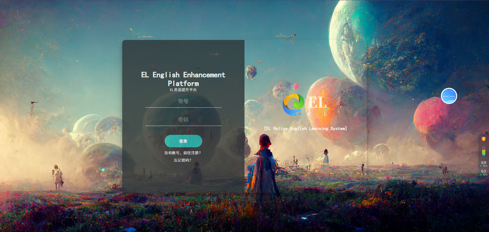
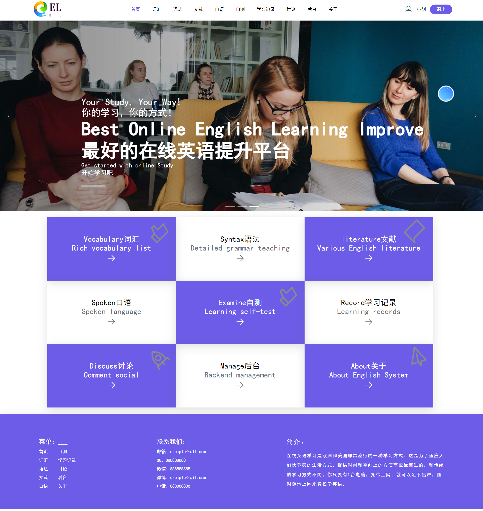
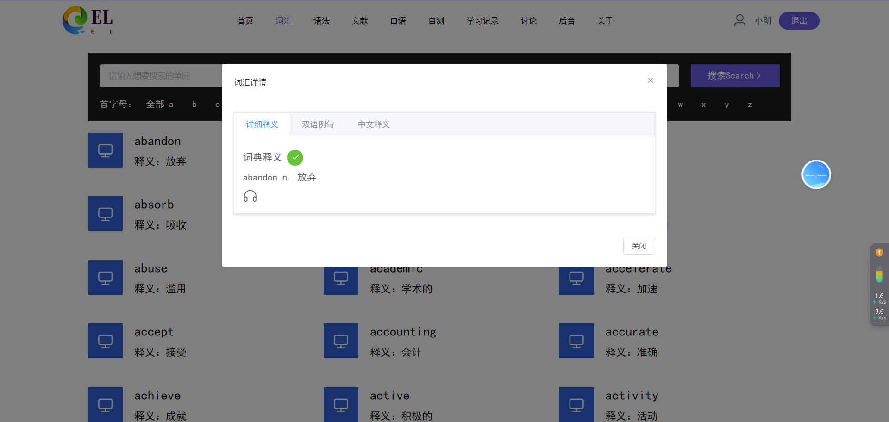
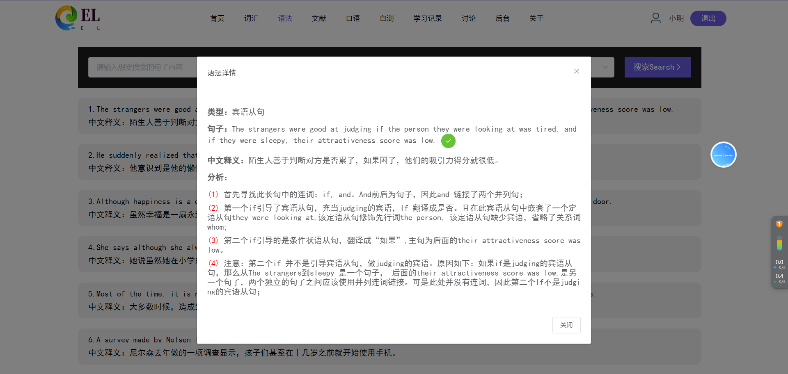
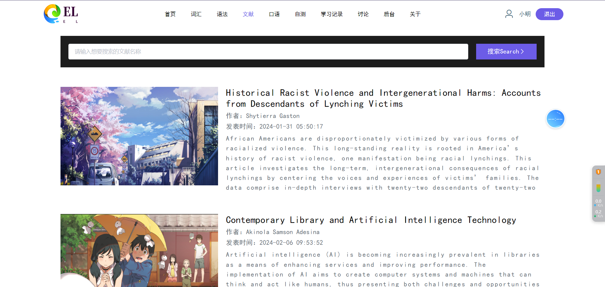
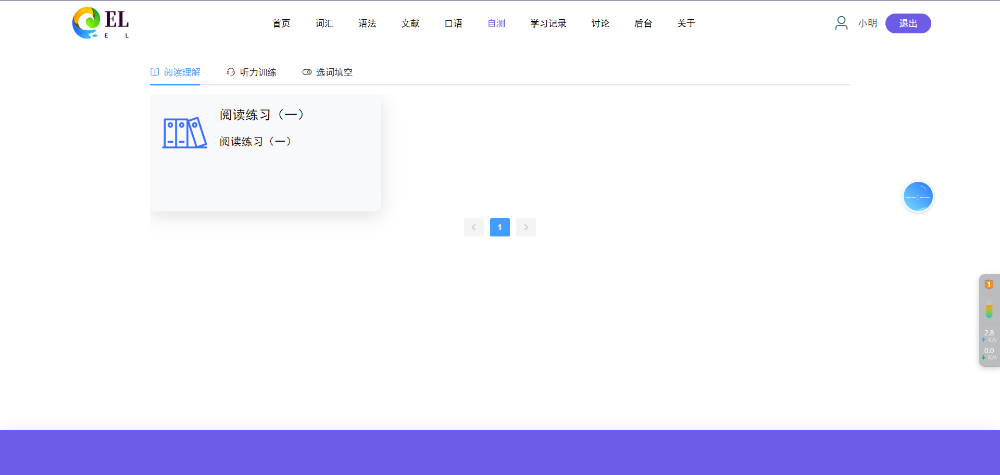
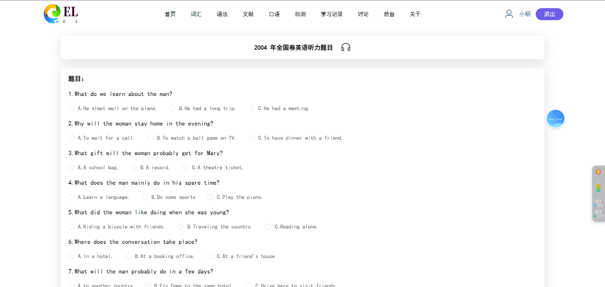
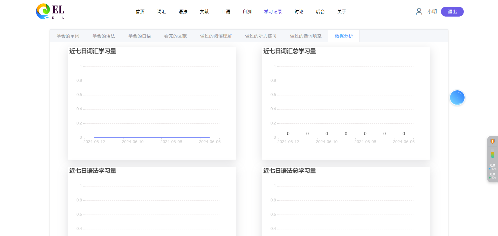
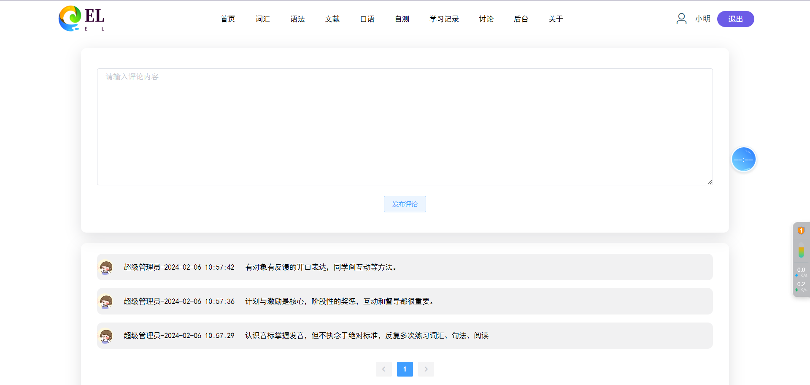
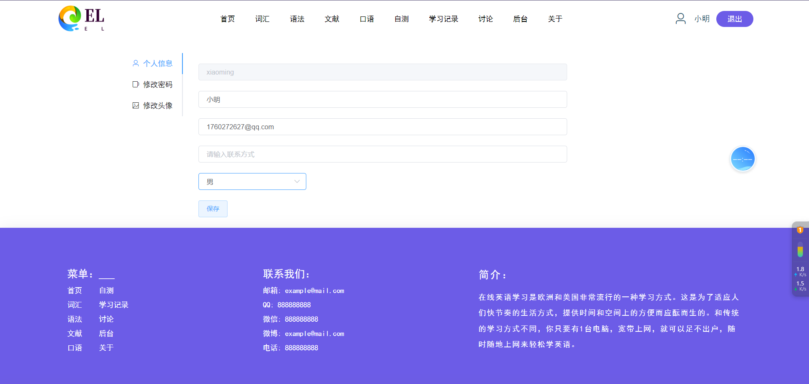
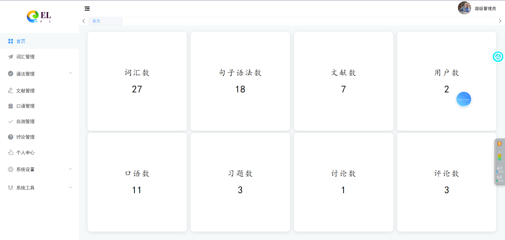

**有问题或获取源码可以咨询企鹅Q1760272627** 
